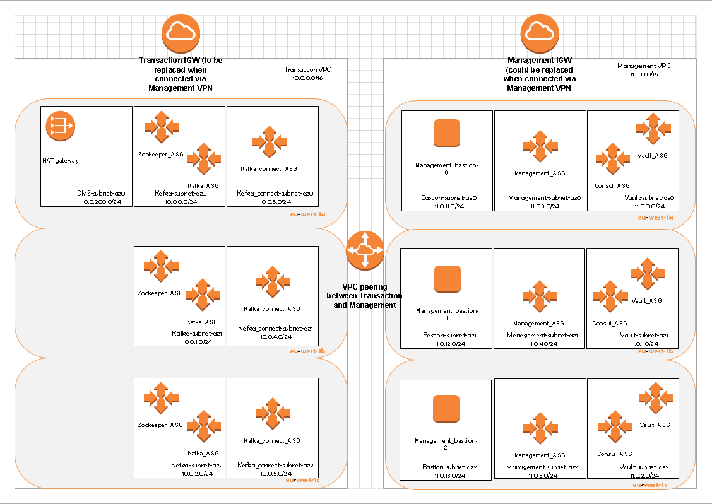
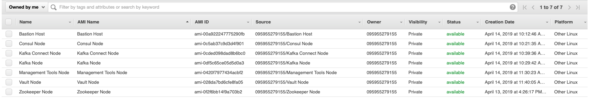
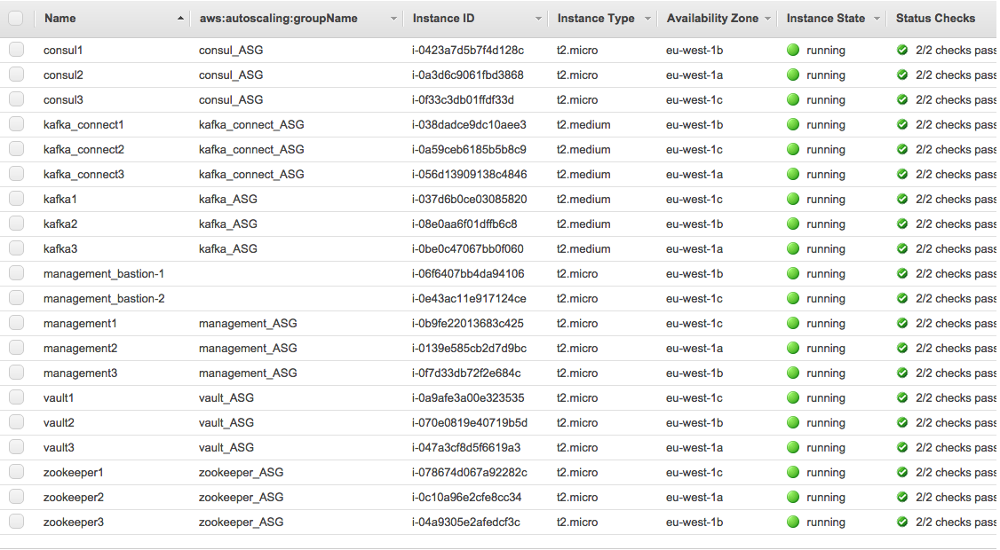

# Kafka Zookeeper with Vault



## Accelerator for running Kafka, Zookeeper, and Vault in AWS 
### About the Accelerator
- Ansible Playbooks to create the AMI's for Bastion hosts, Management tools, Kafka, Zookeeper, Consul and Vault servers
- Terraform files the Bastion hosts, Management tools, Kafka, Zookeeper, Consul and Vault servers/ASG's
- Ansible Playbooks to run Terraform to create the environment, and to shut it all down
- Python scripts to set up the virtual DNS for the multiple ASG instances
- The design has two VPC's:

&nbsp;&nbsp; Transaction - where the main app resides that uses Kafka/zookeeper

&nbsp;&nbsp; Management - where the bastions, Management tools, and Vault reside

- within these VPC's are separate subnets to allow the components to be divided across AZ's
via the ASG's. You can vary the size of the ASG's: 

&nbsp;&nbsp; -The zookeeper ASG has 3 intances (it's recommended to start with 3 to give full resiliance and no more than 5) 

&nbsp;&nbsp; -The Kafka ASG has 5

&nbsp;&nbsp; -The Kafka Connect ASG has 3

&nbsp;&nbsp; -The Consul ASG has 3

&nbsp;&nbsp; -The Vault ASG has 3

&nbsp;&nbsp; -The Management ASG has 3

- The Kafka Connect nodes have been set up in distributed mode, but has no connectors defined

- VPC peering allows traffic between the Management and Transaction VPC's

- The ASG intances get allocated valid Name tags (and DNS names) via instance tracking 
DynamoDB tables, setu up by the Python scripts run at instantiation (AWS User-Data). DynamoDB tables were used instead of S3 objects because of issues with 
latency and race conditions. Often instances would get the same names on environment 
creation. If you wish to use S3, there is commented code both in the Packer and Terraform files that 
show you how to do this.

- The Management instances have two pre-installed Kafka and Zookeeper management tools 
installed via docker images: 
    - Kafka Manager (port 9000 - https://github.com/yahoo/kafka-manager)
    - Zoonavigator (port 8001 - https://github.com/elkozmon/zoonavigator)
    
- The Consul ASG has an ELB in front of it for ASG health checking and allows the Vault cluster 
instances to utilise the Consul cluster, as the consul client agents just don't work.


### Pre-Reqs
- Terraform installed
- Ansible installed
- AWS CLI installed

### Getting Started Instructions
#### Populate your Ansible variable file, and encript it with Ansible-Vault
- create a vault password file somewhere safe and make it hidden... perhaps ~/.vaultpass.txt and put the password in there that you'll use for vault
- The create a file in the Ansible directory called variables.yml using the command 'ansible-vault edit variables.yml --vault-password-file ~/.vault_pass.txt', to look like:
```
pem_file_location: "path to where you have your .pem file"
pem_file: "name of the .pem file"
aws_account_id: "root account id"
arn_for_terraform_iam_role: "arn for the iam role to be used by Terraform"
aws_access_key: "access key for ssh user"
aws_secret_key: "secrey key for ssh user"
s3_state_bucket_name: "name for the terraform start bucket"
access_key_pair: "genned ker pair needed for the instance user of the servers"

```
Replace these with your values

#### run the Ansible create AMI Playbooks
go to the Ansible Directory and run all the playbooks with this command
    `ansible-playbook bastion.yml consul.yml kafka.yml kafka_connect.yml management_tools.yml vault.yml zookeeper.yml terraform_setup.yml --vault-password-file ~/.vault_pass.txt > ami-setup.log`
    
- when all built successfully you shouls see a list like this in your EC2 -> My AMI's
    

### Using the Environment
- In The Ansible Directory run this command:
    `ansible-playbook run-terraform.yml  --vault-password-file ~/.vault_pass.txt > terraform.log`
- when fully run, your AWS instances will look like:


### to-Do's
- Vault requires harcoded AWS keys in run-vault, this needs fixing
- Consul requires harcoded AWS keys in run-consul, this needs fixing

### License
Copyright [2017] [Paul Pogonoski]

Licensed under the Apache License, Version 2.0 (the "License");
you may not use this file except in compliance with the License.
You may obtain a copy of the License at

    http://www.apache.org/licenses/LICENSE-2.0

Unless required by applicable law or agreed to in writing, software
distributed under the License is distributed on an "AS IS" BASIS,
WITHOUT WARRANTIES OR CONDITIONS OF ANY KIND, either express or implied.
See the License for the specific language governing permissions and
limitations under the License.
